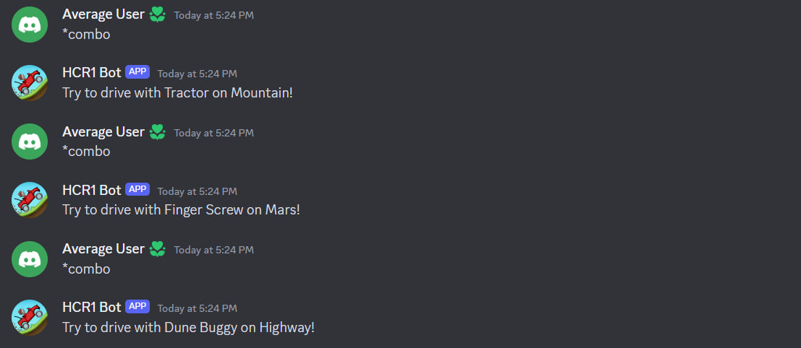

# 🚗 HCR1 Bot

This bot is designed specifically for Discord servers associated with Hill Climb Racing 1 game. It allows to get useful information about some aspects of the game (like purchase cost of a vehicle or a map, cost for fully upgrading a vehicle etc) in just one command.

## Available commands
- `*help` - general info about bot and list of its commands

- `*combo` - roll random vehicle + stage combo

- `*hcrinfo <vehicle_or_stage_name>` - show useful info about particular vehicle or stage

Note: this works fine with different spacing characters and casing, as well as with aliases (like abbreviations or other commonly used names that differ from original name)

If vehicle/stage name is not provided, it prompts the user to enter it and suggests random vehicle/stage

# More to be done!
- Show info about fuel placement on stages in `*hcrinfo`
- Make `*hcrinfo` deal with typos in vehicle/stage name
- New `*wr` command to get the current world record on a combo
